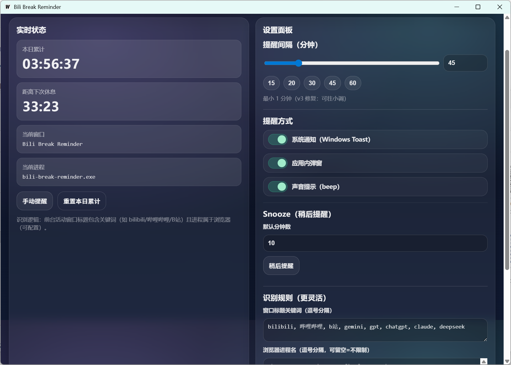

<div align="center">

  <h1>🛡️ Bili-Break-Reminder</h1>
  
  <p>
    <strong>一款基于 Go + Wails 构建的现代化桌面端防沉迷助手</strong>
  </p>

  <p>
    <a href="https://golang.org/">
      
    </a>
    <a href="https://wails.io/">
      
    </a>
    <a href="https://vuejs.org/">
      
    </a>
    <a href="https://github.com/mddnbb66-bit/bili-break-reminder/releases">
      
    </a>
  </p>

</div>

---

## 📖 项目简介

**Bili-Break-Reminder** 是一款跨平台的桌面端健康管理应用，专为需要长时间面对屏幕的学生和开发者设计。

它采用 **Go (Golang)** 作为高性能后端，结合 **Vue 3** 构建现代化 UI，能够智能监控应用使用时长，并在适当时机提醒用户休息，有效预防视疲劳和久坐带来的健康问题（如腱鞘炎、腰肌劳损等）。

> *"代码写得爽，身体更重要。"*
> *"无限代码写个爽（bushi"*

## ✨ 核心特性

* **🖥️ 跨平台支持**：完美运行于 Windows 环境（macOS/Linux 适配中）。
* **⚡ 极致性能**：基于 Go 语言原生开发，内存占用极低，不卡顿。
* **🎨 现代化 UI**：使用 Vue 3 + Vite 构建，界面简洁美观，交互流畅。
* **🛡️ 智能监控**：自动检测久坐时长，非侵入式提醒，工作/休息两不误。
* **⚙️ 高度可配置**：(开发中) 支持自定义工作时长、休息间隔及提示音。

## 🛠️ 技术栈

本项目是一个标准的 **前后端分离** 桌面应用架构示例：

| 模块 | 技术选型 | 说明 |
| :--- | :--- | :--- |
| **核心后端** | **Golang (1.20+)** | 处理系统调用、并发逻辑与数据持久化 |
| **应用框架** | **Wails v2** | 提供 Go 与前端的高性能 JS 桥接 |
| **前端框架** | **Vue 3** | 构建响应式用户界面 |
| **构建工具** | **Vite** | 极速冷启动与模块热更新 |

## 📸 应用截图

<div align="center">
  
</div>


## 🚀 快速开始

### 环境要求

* Go 1.18+
* Node.js 16+
* Wails CLI 工具

### 编译与运行

```bash
# 1. 克隆项目仓库
git clone [https://github.com/mddnbb66-bit/bili-break-reminder.git](https://github.com/mddnbb66-bit/bili-break-reminder.git)

# 2. 进入项目目录
cd bili-break-reminder

# 3. 安装依赖并编译 (生成 exe 文件)
wails build

